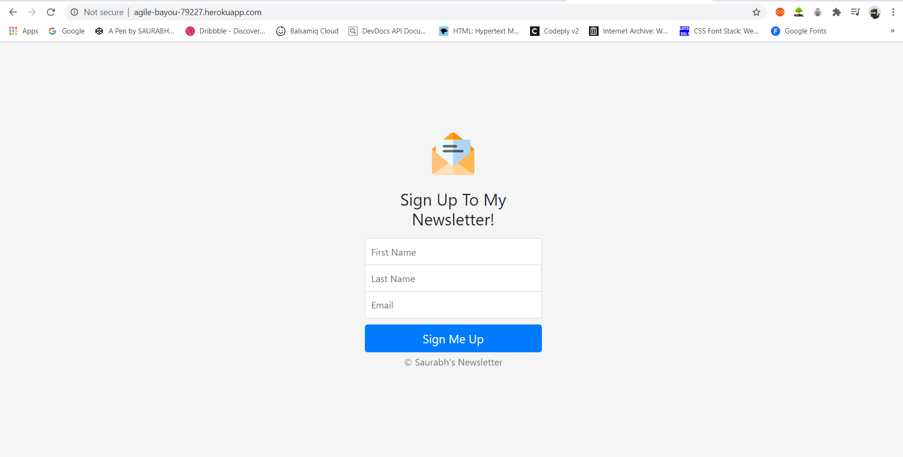
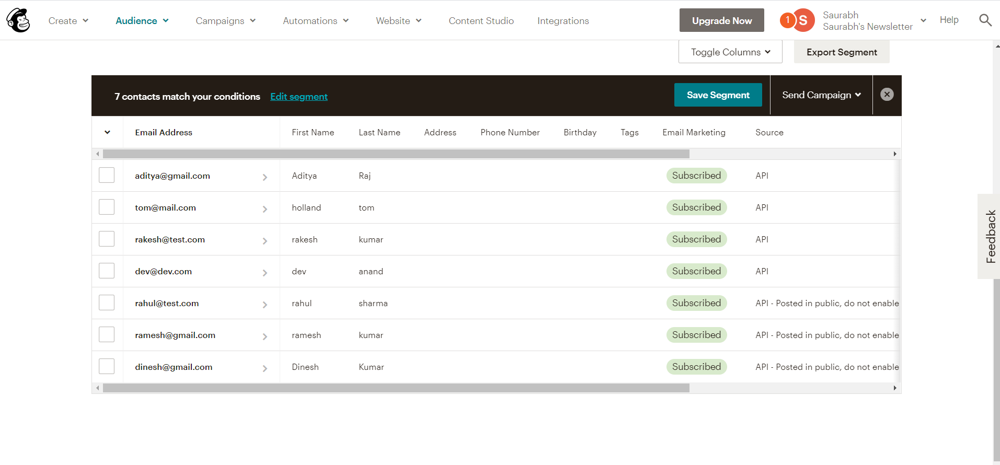

# Saurabh-s-Newsletter
A Newsletter subscription page
heroku link: http://agile-bayou-79227.herokuapp.com/

This is how it will look like 

This is the Subscribers details on mailchimp

This code is for reference , Please add your own mailchimp api id.
